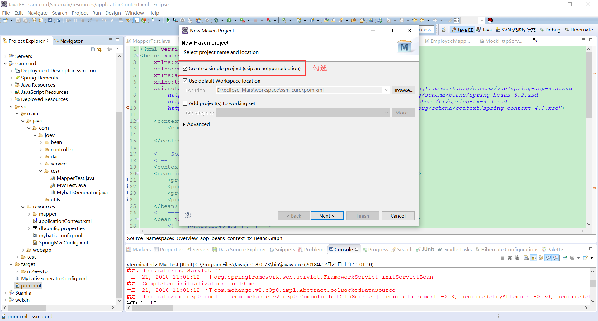
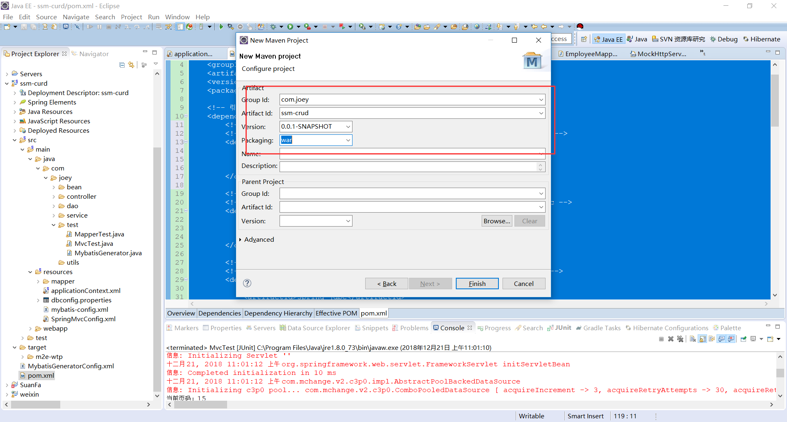
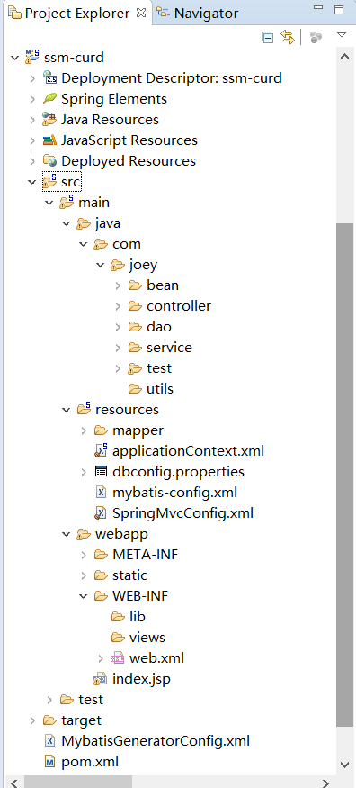

# 				SSM框架整合

1. 创建Maven项目







2. pom.xml中导入Maven依赖

```xml
<project xmlns="http://maven.apache.org/POM/4.0.0" xmlns:xsi="http://www.w3.org/2001/XMLSchema-instance"
	xsi:schemaLocation="http://maven.apache.org/POM/4.0.0 http://maven.apache.org/xsd/maven-4.0.0.xsd">
	<modelVersion>4.0.0</modelVersion>
	<groupId>com.joey</groupId>
	<artifactId>ssm-curd</artifactId>
	<version>0.0.1-SNAPSHOT</version>
	<packaging>war</packaging>

	<!-- 引入项目依赖的jar包 -->
	<dependencies>
		<!-- pagehelper -->
		<!-- https://mvnrepository.com/artifact/com.github.pagehelper/pagehelper -->
		<dependency>
		    <groupId>com.github.pagehelper</groupId>
		    <artifactId>pagehelper</artifactId>
		    <version>5.0.0</version>
		</dependency>
				
		<!-- springMVC、spring -->
		<!-- https://mvnrepository.com/artifact/org.springframework/spring-webmvc -->
		<dependency>
			<groupId>org.springframework</groupId>
			<artifactId>spring-webmvc</artifactId>
			<version>5.1.3.RELEASE</version>
		</dependency>
		
		<!-- spring-jdbc -->
		<!-- https://mvnrepository.com/artifact/org.springframework/spring-jdbc -->
		<dependency>
		    <groupId>org.springframework</groupId>
		    <artifactId>spring-jdbc</artifactId>
		    <version>5.1.3.RELEASE</version>
		</dependency>
		
		<!-- spring-test -->
		<!-- https://mvnrepository.com/artifact/org.springframework/spring-test -->
		<dependency>
		    <groupId>org.springframework</groupId>
		    <artifactId>spring-test</artifactId>
		    <version>5.1.3.RELEASE</version>
		    <scope>test</scope>
		</dependency>
        
		<!-- spring面向切面编程 -->
		<!-- https://mvnrepository.com/artifact/org.springframework/spring-aspects -->
		<dependency>
		    <groupId>org.springframework</groupId>
		    <artifactId>spring-aspects</artifactId>
		    <version>5.1.3.RELEASE</version>
		</dependency>
		
		<!-- Mybatis -->
		<!-- https://mvnrepository.com/artifact/org.mybatis/mybatis -->
		<dependency>
		    <groupId>org.mybatis</groupId>
		    <artifactId>mybatis</artifactId>
		    <version>3.4.6</version>
		</dependency>
		
		<!-- spring整合Mybatis适配包 -->
		<!-- https://mvnrepository.com/artifact/org.mybatis/mybatis-spring -->
		<dependency>
		    <groupId>org.mybatis</groupId>
		    <artifactId>mybatis-spring</artifactId>
		    <version>1.3.2</version>
		</dependency>
		
		<!-- c3p0数据库连接池驱动 -->
		<!-- https://mvnrepository.com/artifact/com.mchange/c3p0 -->
		<dependency>
		    <groupId>com.mchange</groupId>
		    <artifactId>c3p0</artifactId>
		    <version>0.9.5.2</version>
		</dependency>
		
		<!-- MySql驱动 -->
		<!-- https://mvnrepository.com/artifact/mysql/mysql-connector-java -->
		<dependency>
		    <groupId>mysql</groupId>
		    <artifactId>mysql-connector-java</artifactId>
		    <version>8.0.13</version>
		</dependency>
		
		<!-- web开发使用jstl,servlet-api,junit -->
		<!-- https://mvnrepository.com/artifact/javax.servlet/jstl -->
		<dependency>
		    <groupId>javax.servlet</groupId>
		    <artifactId>jstl</artifactId>
		    <version>1.2</version>
		</dependency>
		<!-- https://mvnrepository.com/artifact/javax.servlet/javax.servlet-api -->
		<dependency>
		    <groupId>javax.servlet</groupId>
		    <artifactId>javax.servlet-api</artifactId>
		    <version>4.0.1</version>
		    <scope>provided</scope>
		</dependency>
		<!-- https://mvnrepository.com/artifact/org.junit.jupiter/junit-jupiter-api -->
		<dependency>
		    <groupId>org.junit.jupiter</groupId>
		    <artifactId>junit-jupiter-api</artifactId>
		    <version>5.3.2</version>
		    <scope>test</scope>
		</dependency>
					
		<!-- Mybatis逆向工程 -->
		<!-- https://mvnrepository.com/artifact/org.mybatis.generator/mybatis-generator-core -->
		<dependency>
		    <groupId>org.mybatis.generator</groupId>
		    <artifactId>mybatis-generator-core</artifactId>
		    <version>1.3.7</version>
		</dependency>
					
	</dependencies>

</project>
```

3. 配置web.xml

```xml
<?xml version="1.0" encoding="UTF-8"?>
<web-app xmlns:xsi="http://www.w3.org/2001/XMLSchema-instance"
	xmlns="http://java.sun.com/xml/ns/javaee"
	xsi:schemaLocation="http://java.sun.com/xml/ns/javaee http://java.sun.com/xml/ns/javaee/web-app_2_5.xsd"
	id="WebApp_ID" version="2.5" >

	<!-- 1.配置Spring启动容器 -->
	<!-- needed for ContextLoaderListener -->
	<context-param>
		<param-name>contextConfigLocation</param-name>
		<!-- 加载Spring配置文件 -->
		<param-value>classpath:applicationContext.xml</param-value>
	</context-param>

	<!-- Bootstraps the root web application context before servlet initialization -->
	<listener>
		<listener-class>org.springframework.web.context.ContextLoaderListener</listener-class>
	</listener>

	<!-- 2.SpringMVC前端控制器，拦截所有请求 -->
	<!-- The front controller of this Spring Web application, responsible for handling all application requests -->
	<servlet>
		<servlet-name>springDispatcherServlet</servlet-name>
		<servlet-class>org.springframework.web.servlet.DispatcherServlet</servlet-class>
		<init-param>
			<param-name>contextConfigLocation</param-name>
			<param-value>classpath:SpringMvcConfig.xml</param-value>
		</init-param>
		<load-on-startup>1</load-on-startup>
	</servlet>
	<!-- Map all requests to the DispatcherServlet for handling -->
	<servlet-mapping>
		<servlet-name>springDispatcherServlet</servlet-name>
		<url-pattern>/</url-pattern>
	</servlet-mapping>
	
	<!-- 3.字符编码过滤器，放在所有过滤器前 -->
	<filter>
		<filter-name>CharacterEncodingFilter</filter-name>
		<filter-class>org.springframework.web.filter.CharacterEncodingFilter</filter-class>
		<init-param>
			<param-name>encoding</param-name>
			<param-value>utf-8</param-value>
		</init-param>
		<init-param>
			<param-name>forceRequestEncoding</param-name>
			<param-value>true</param-value>
		</init-param>
		<init-param>
			<param-name>forceResponseEncoding</param-name>
			<param-value>true</param-value>
		</init-param>
	</filter>
	<filter-mapping>
		<filter-name>CharacterEncodingFilter</filter-name>
		<url-pattern>/*</url-pattern>
	</filter-mapping>
	
	<!-- 4.使用Rest风格的URI，将页面普通的post请求转为指定的delete或者put请求 -->
	<filter>
		<filter-name>HiddenHttpMethodFilter</filter-name>
		<filter-class>org.springframework.web.filter.HiddenHttpMethodFilter</filter-class>
	</filter>
	<filter-mapping>
		<filter-name>HiddenHttpMethodFilter</filter-name>
		<url-pattern>/*</url-pattern>
	</filter-mapping>
	<filter>
		<filter-name>HttpPutFormContentFilter</filter-name>
		<filter-class>org.springframework.web.filter.HttpPutFormContentFilter</filter-class>
	</filter>
	<filter-mapping>
		<filter-name>HttpPutFormContentFilter</filter-name>
		<url-pattern>/*</url-pattern>
	</filter-mapping>
</web-app>
```

4. 配置SpringMVC配置文件

```xml
<?xml version="1.0" encoding="UTF-8"?>
<beans xmlns="http://www.springframework.org/schema/beans"
	xmlns:xsi="http://www.w3.org/2001/XMLSchema-instance"
	xmlns:context="http://www.springframework.org/schema/context"
	xmlns:mvc="http://www.springframework.org/schema/mvc"
	xsi:schemaLocation="http://www.springframework.org/schema/mvc http://www.springframework.org/schema/mvc/spring-mvc-4.3.xsd
		http://www.springframework.org/schema/beans http://www.springframework.org/schema/beans/spring-beans-3.2.xsd
		http://www.springframework.org/schema/context http://www.springframework.org/schema/context/spring-context-4.3.xsd">

	<!--SpringMVC的配置文件，包含网站跳转逻辑的控制，配置  -->
	<context:component-scan base-package="com.joey" use-default-filters="false">
		<!--只扫描@Controller注解的控制器。  -->
		<context:include-filter type="annotation" expression="org.springframework.stereotype.Controller"/>
	</context:component-scan>
	
	<!--配置视图解析器，方便页面返回  -->
	<bean class="org.springframework.web.servlet.view.InternalResourceViewResolver">
		<property name="prefix" value="/WEB-INF/views/"></property>
		<property name="suffix" value=".jsp"></property>
	</bean>
	
	<!--两个标准配置  -->
	<!-- 将springmvc不能处理的请求交给tomcat -->
	<mvc:default-servlet-handler/>
	<!-- 能支持springmvc更高级的一些功能，JSR303校验，快捷的ajax...映射动态请求 -->
	<mvc:annotation-driven/>
</beans>
```

5. 配置Spring配置文件

```xml
<?xml version="1.0" encoding="UTF-8"?>
<beans xmlns="http://www.springframework.org/schema/beans"
	xmlns:xsi="http://www.w3.org/2001/XMLSchema-instance"
	xmlns:context="http://www.springframework.org/schema/context"
	xmlns:aop="http://www.springframework.org/schema/aop"
	xmlns:tx="http://www.springframework.org/schema/tx"
	xsi:schemaLocation="http://www.springframework.org/schema/aop http://www.springframework.org/schema/aop/spring-aop-4.3.xsd
		http://www.springframework.org/schema/beans http://www.springframework.org/schema/beans/spring-beans-3.2.xsd
		http://www.springframework.org/schema/tx http://www.springframework.org/schema/tx/spring-tx-4.3.xsd
		http://www.springframework.org/schema/context http://www.springframework.org/schema/context/spring-context-4.3.xsd">
	
	<context:component-scan base-package="com.joey">
		<context:exclude-filter type="annotation"
			expression="org.springframework.stereotype.Controller" />
	</context:component-scan>
	
	<!-- Spring的配置文件，这里主要配置和业务逻辑有关的 -->
	<!--=================== 数据源，事务控制，xxx ================-->
	<context:property-placeholder location="classpath:dbconfig.properties" />
	<bean id="pooledDataSource" class="com.mchange.v2.c3p0.ComboPooledDataSource">
		<property name="jdbcUrl" value="${jdbc.jdbcUrl}"></property>
		<property name="driverClass" value="${jdbc.driverClass}"></property>
		<property name="user" value="${jdbc.user}"></property>
		<property name="password" value="${jdbc.password}"></property>
	</bean>
	<!--================== 配置和MyBatis的整合=============== -->
	<bean id="sqlSessionFactory" class="org.mybatis.spring.SqlSessionFactoryBean">
		<!-- 指定mybatis全局配置文件的位置 -->
		<property name="configLocation" value="classpath:mybatis-config.xml"></property>
		<property name="dataSource" ref="pooledDataSource"></property>
		<!-- 指定mybatis，mapper文件的位置 -->
		<property name="mapperLocations" value="classpath:mapper/*.xml"></property>
	</bean>

	<!-- 配置扫描器，将mybatis接口的实现加入到ioc容器中 -->
	<bean class="org.mybatis.spring.mapper.MapperScannerConfigurer">
		<!--扫描所有dao接口的实现，加入到ioc容器中 -->
		<property name="basePackage" value="com.joey.dao"></property>
	</bean>
	
	<!-- 配置一个可以执行批量的sqlSession -->
	<bean id="sqlSession" class="org.mybatis.spring.SqlSessionTemplate">
		<constructor-arg name="sqlSessionFactory" ref="sqlSessionFactory"></constructor-arg>
		<constructor-arg name="executorType" value="BATCH"></constructor-arg>
	</bean>
	<!--=============================================  -->

	<!-- ===============事务控制的配置 ================-->
	<bean id="transactionManager" class="org.springframework.jdbc.datasource.DataSourceTransactionManager">
		<!--控制住数据源  -->
		<property name="dataSource" ref="pooledDataSource"></property>
	</bean>
	<!--开启基于注解的事务，使用xml配置形式的事务（必要主要的都是使用配置式）  -->
	<aop:config>
		<!-- 切入点表达式 -->
		<aop:pointcut expression="execution(* com.joey.service..*(..))" id="txPoint"/>
		<!-- 配置事务增强 -->
		<aop:advisor advice-ref="txAdvice" pointcut-ref="txPoint"/>
	</aop:config>
	
	<!--配置事务增强，事务如何切入  -->
	<tx:advice id="txAdvice" transaction-manager="transactionManager">
		<tx:attributes>
			<!-- 所有方法都是事务方法 -->
			<tx:method name="*"/>
			<!--以get开始的所有方法  -->
			<tx:method name="get*" read-only="true"/>
		</tx:attributes>
	</tx:advice>
	
	<!-- Spring配置文件的核心点（数据源、与mybatis的整合，事务控制） -->
</beans>
```

6. Mybatis逆向工程配置（或者手动编写mapper映射文件和bean文件）

> ​	配置文件：MybatisGeneratorConfig.xml

```xml
<?xml version="1.0" encoding="UTF-8"?>
<!DOCTYPE generatorConfiguration
  PUBLIC "-//mybatis.org//DTD MyBatis Generator Configuration 1.0//EN"
  "http://mybatis.org/dtd/mybatis-generator-config_1_0.dtd">
<generatorConfiguration>

	<context id="DB2Tables" targetRuntime="MyBatis3">
		<commentGenerator>
			<property name="suppressAllComments" value="true" />
		</commentGenerator>
		<!-- 配置数据库连接 -->
		<jdbcConnection driverClass="com.mysql.cj.jdbc.Driver"
			connectionURL="jdbc:mysql://localhost:3306/joey_crud" userId="root"
			password="123456">
		</jdbcConnection>

		<javaTypeResolver>
			<property name="forceBigDecimals" value="false" />
		</javaTypeResolver>

		<!-- 指定javaBean生成的位置 -->
		<javaModelGenerator targetPackage="com.joey.bean"
			targetProject=".\src\main\java">
			<property name="enableSubPackages" value="true" />
			<property name="trimStrings" value="true" />
		</javaModelGenerator>

		<!--指定sql映射文件生成的位置 -->
		<sqlMapGenerator targetPackage="mapper" targetProject=".\src\main\resources">
			<property name="enableSubPackages" value="true" />
		</sqlMapGenerator>

		<!-- 指定dao接口生成的位置，mapper接口 -->
		<javaClientGenerator type="XMLMAPPER"
			targetPackage="com.joey.dao" targetProject=".\src\main\java">
			<property name="enableSubPackages" value="true" />
		</javaClientGenerator>

		<!-- table指定每个表的生成策略 -->
		<table tableName="emp" domainObjectName="Employee"></table>
		<tabl<?xml version="1.0" encoding="UTF-8"?>
<!DOCTYPE generatorConfiguration
  PUBLIC "-//mybatis.org//DTD MyBatis Generator Configuration 1.0//EN"
  "http://mybatis.org/dtd/mybatis-generator-config_1_0.dtd">
<generatorConfiguration>

	<context id="DB2Tables" targetRuntime="MyBatis3">
		<commentGenerator>
			<property name="suppressAllComments" value="true" />
		</commentGenerator>
		<!-- 配置数据库连接 -->
		<jdbcConnection driverClass="com.mysql.cj.jdbc.Driver"
			connectionURL="jdbc:mysql://localhost:3306/joey_crud" userId="root"
			password="123456">
		</jdbcConnection>

		<javaTypeResolver>
			<property name="forceBigDecimals" value="false" />
		</javaTypeResolver>

		<!-- 指定javaBean生成的位置 -->
		<javaModelGenerator targetPackage="com.joey.bean"
			targetProject=".\src\main\java">
			<property name="enableSubPackages" value="true" />
			<property name="trimStrings" value="true" />
		</javaModelGenerator>

		<!--指定sql映射文件生成的位置 -->
		<sqlMapGenerator targetPackage="mapper" targetProject=".\src\main\resources">
			<property name="enableSubPackages" value="true" />
		</sqlMapGenerator>

		<!-- 指定dao接口生成的位置，mapper接口 -->
		<javaClientGenerator type="XMLMAPPER"
			targetPackage="com.joey.dao" targetProject=".\src\main\java">
			<property name="enableSubPackages" value="true" />
		</javaClientGenerator>


		<!-- table指定每个表的生成策略 -->
		<table tableName="emp" domainObjectName="Employee"></table>
		<table tableName="dept" domainObjectName="Department"></table>
	</context>
</generatorConfiguration>e tableName="dept" domainObjectName="Department"></table>
	</context>
</generatorConfiguration>
```

> ​	启动文件：MybatisGenerator.java

```java
package com.joey.test;

import java.io.File;
import java.util.ArrayList;
import java.util.List;

import org.mybatis.generator.api.MyBatisGenerator;
import org.mybatis.generator.config.Configuration;
import org.mybatis.generator.config.xml.ConfigurationParser;
import org.mybatis.generator.internal.DefaultShellCallback;

public class MybatisGenerator {
	public static void main(String[] args) throws Exception {
		List<String> warnings = new ArrayList<String>();
		boolean overwrite = true;
		File configFile = new File("MybatisGeneratorConfig.xml");
		ConfigurationParser cp = new ConfigurationParser(warnings);
		Configuration config = cp.parseConfiguration(configFile);
		DefaultShellCallback callback = new DefaultShellCallback(overwrite);
		MyBatisGenerator myBatisGenerator = new MyBatisGenerator(config,
				callback, warnings);
		myBatisGenerator.generate(null);
	}
}
```

7. 编写Mapper测试文件，测试系统配置是否正确

```java
package com.joey.test;

import java.util.UUID;

import org.apache.ibatis.session.SqlSession;
import org.junit.Test;
import org.junit.runner.RunWith;
import org.springframework.beans.factory.annotation.Autowired;
import org.springframework.test.context.ContextConfiguration;
import org.springframework.test.context.junit4.SpringJUnit4ClassRunner;

import com.joey.bean.Employee;
import com.joey.dao.DepartmentMapper;
import com.joey.dao.EmployeeMapper;

/**
 * 测试dao层的工作
 * @author joey
 *推荐Spring的项目就可以使用Spring的单元测试，可以自动注入我们需要的组件
 *1、导入SpringTest模块
 *2、@ContextConfiguration指定Spring配置文件的位置
 *3、直接autowired要使用的组件即可
 */
@RunWith(SpringJUnit4ClassRunner.class)
@ContextConfiguration(locations={"classpath:applicationContext.xml"})
public class MapperTest {
	
	@Autowired
	DepartmentMapper departmentMapper;
	
	@Autowired
	EmployeeMapper employeeMapper;
	
	@Autowired
	SqlSession sqlSession;
	
	@Test
	public void testCRUD(){
		//1、创建SpringIOC容器
		ApplicationContext ioc = new ClassPathXmlApplicationContext("applicationContext.xml");
		//2、从容器中获取mapper
		DepartmentMapper bean = ioc.getBean(DepartmentMapper.class);
        //能正常执行输出类似 org.apache.ibatis.binding.MapperProxy@5cde6747 说明配置正确
        System.out.println(bean);
		System.out.println(departmentMapper);
		
		//1、插入几个部门
		departmentMapper.insertSelective(new Department(null, "开发部"));
		departmentMapper.insertSelective(new Department(null, "测试部"));
		
		//2、生成员工数据，测试员工插入
		employeeMapper.insertSelective(new Employee(null, "Jerry", "M", "Jerry@joey.com", 1));
		
		//3、批量插入多个员工；批量，使用可以执行批量操作的sqlSession。
		
//		for(){
//			employeeMapper.insertSelective(new Employee(null, , "M", "Jerry@joey.com", 1));
//		}
		EmployeeMapper mapper = sqlSession.getMapper(EmployeeMapper.class);
		for(int i = 0;i<1000;i++){
			String uid = UUID.randomUUID().toString().substring(0,5)+i;
			mapper.insertSelective(new Employee(null,uid, "M", uid+"@joey.com", 1));
		}
		System.out.println("批量完成");	
	}
}

```

8. 编写Service类

```java
package com.joey.service;

import java.util.List;

import org.springframework.beans.factory.annotation.Autowired;
import org.springframework.stereotype.Service;

import com.joey.bean.Employee;
import com.joey.dao.EmployeeMapper;

@Service
public class EmployeeService {
	
	@Autowired
	EmployeeMapper employeeMapper;

	/**
	 * 查询所有员工
	 * @return
	 */
	public List<Employee> getAll() {
		// TODO Auto-generated method stub
		return employeeMapper.selectByExample(null);
	}

}
```

9. 编写Controller类

```java
package com.joey.controller;

import java.util.List;
import org.springframework.beans.factory.annotation.Autowired;
import org.springframework.stereotype.Controller;
import org.springframework.ui.Model;
import org.springframework.web.bind.annotation.RequestMapping;
import org.springframework.web.bind.annotation.RequestParam;
import com.github.pagehelper.PageHelper;
import com.github.pagehelper.PageInfo;
import com.joey.bean.Employee;
import com.joey.service.EmployeeService;
/**
 * 处理员工CRUD请求
 */
@Controller
public class EmployeeController {

	@Autowired
	EmployeeService employeeService;

	/**
	 * 查询员工数据（分页查询）
	 * 
	 * @return
	 */
	@RequestMapping("/emps")
	public String getEmps(
			@RequestParam(value = "pn", defaultValue = "1") Integer pn,
			Model model) {
		// 这不是一个分页查询；
		// 引入PageHelper分页插件
		// 在查询之前只需要调用，传入页码，以及每页的大小
		PageHelper.startPage(pn, 5);
		// startPage后面紧跟的这个查询就是一个分页查询
		List<Employee> emps = employeeService.getAll();
		// 使用pageInfo包装查询后的结果，只需要将pageInfo交给页面就行了。
		// 封装了详细的分页信息,包括有我们查询出来的数据，传入连续显示的页数
		PageInfo<Employee> page = new PageInfo<Employee>(emps, 5);
		model.addAttribute("pageInfo", page);
		return "list";
	}
}
```

10. 编写SpringMVC前端视图返回数据测试类

```java
package com.joey.test;

import java.util.List;

import org.junit.Before;
import org.junit.Test;
import org.junit.runner.RunWith;
import org.springframework.beans.factory.annotation.Autowired;
import org.springframework.mock.web.MockHttpServletRequest;
import org.springframework.test.context.ContextConfiguration;
import org.springframework.test.context.junit4.SpringJUnit4ClassRunner;
import org.springframework.test.context.web.WebAppConfiguration;
import org.springframework.test.web.servlet.MockMvc;
import org.springframework.test.web.servlet.MvcResult;
import org.springframework.test.web.servlet.request.MockMvcRequestBuilders;
import org.springframework.test.web.servlet.setup.MockMvcBuilders;
import org.springframework.web.context.WebApplicationContext;

import com.joey.bean.Employee;
import com.github.pagehelper.PageInfo;

/**
 * 使用Spring测试模块提供的测试请求功能，测试curd请求的正确性
 * Spring4测试的时候，需要servlet3.0的支持
 * @author joey
 * 
 */
@RunWith(SpringJUnit4ClassRunner.class)
@WebAppConfiguration
@ContextConfiguration(locations = { "classpath:applicationContext.xml",
		"file:src/main/resources/SpringMvcConfig.xml" })
public class MvcTest {
	// 传入Springmvc的ioc
	@Autowired
	WebApplicationContext context;
	// 虚拟mvc请求，获取到处理结果。
	MockMvc mockMvc;

	@Before
	public void initMokcMvc() {
		mockMvc = MockMvcBuilders.webAppContextSetup(context).build();
	}

	@Test
	public void testPage() throws Exception {
		//模拟请求拿到返回值
		MvcResult result = mockMvc.perform(MockMvcRequestBuilders.get("/emps").param("pn", "1"))
				.andReturn();
		//请求成功以后，请求域中会有pageInfo；我们可以取出pageInfo进行验证
		MockHttpServletRequest request = result.getRequest();
		PageInfo pi = (PageInfo) request.getAttribute("pageInfo");
		System.out.println("当前页码："+pi.getPageNum());
		System.out.println("总页码："+pi.getPages());
		System.out.println("总记录数："+pi.getTotal());
		System.out.println("在页面需要连续显示的页码");
		int[] nums = pi.getNavigatepageNums();
		for (int i : nums) {
			System.out.print(" "+i);
		}
		System.out.println();
		//获取员工数据
		List<Employee> list = pi.getList();
		for (Employee employee : list) {
			System.out.println("ID："+employee.getId()+"==>Name:"+employee.getName());
		}	
	}
}
```

> ​	输出：	
>
> ​		当前页码：1
> ​		总页码：69
> ​		总记录数：1021
> ​		在页面需要连续显示的页码
> ​		 1 2 3 4 5
> ​		ID：1022==>Name:ada290
> ​		ID：1023==>Name:ca5da1
> ​		ID：1024==>Name:86ce02
> ​		ID：1025==>Name:ea8f73
> ​		ID：1026==>Name:91c6c4

11. 就可以开始CRUD搬砖之路

